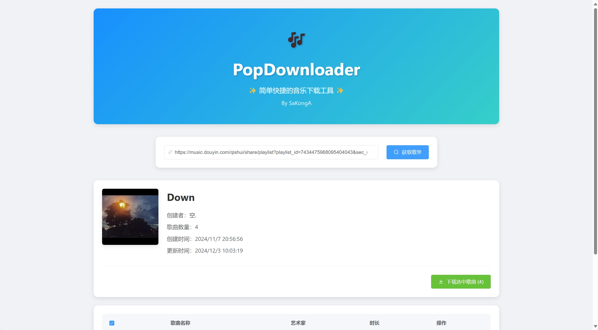
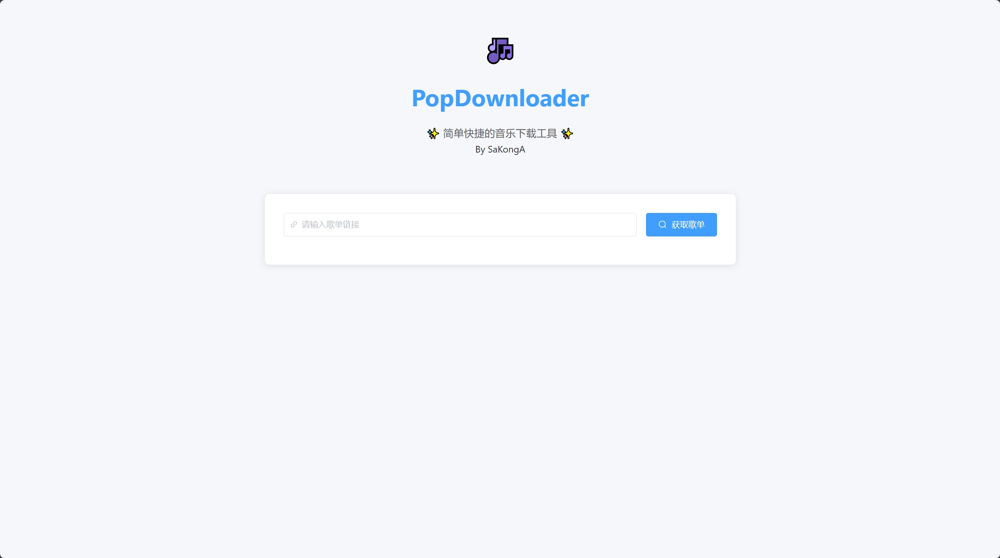

<div align="center">

<h1 align="center">PopDownloader</h1>

✨ 一个轻量化、简洁的汽水音乐歌单打包下载站点 ✨
</div>

## 🔨 启动项目
0. 确保设备已经安装[Node.js](https://nodejs.org/)
1. 安装项目所需依赖
```bash
> npm install
```
2. 启动项目
```bash
> npm start
```
3. 访问网站，页面链接见控制台输出
```bash
> popDownloader@1.0.0 start
> node server.js

Server is running on http://localhost:3000     <———— 此 URL 即页面链接
```

## 📌 已完成的功能
  
| 状态 |          功能               |
|:--------:|:-------------------------------:|
|    ✅     | 歌单分享链接过滤                |
|    ✅     | 歌单列表获取                    |
|    ✅     | 音频音乐下载                    |
|    ✅     | 音频音乐打包下载                |
|    ✅     | 视频音乐下载                    |
|    ✅     | 视频音乐转音频下载              |
|    ✅     | 视频音乐自动转音频后打包下载    |

## ⚡ 特性
* 使用 Node.js 构建前后端，开发维护简单，兼容性强；

* 使用Element UI，外观简洁耐看；

* 使用歌单分享链接直接导入，方便快捷；

* 更多特性，正在陆续更新...

## 截图
<div align="center">
	
    
</div>

## 支持
* 欢迎前往[Issue](https://github.com/SaKongA/PopDownloader/issues)提出您遇到的任何问题；
* 如果您对我的项目感兴趣，需要更多帮助与支持，再或需要完善其他功能，欢迎联系我！

## 声明
* 本项目不涉及通过漏洞获取VIP资源等，VIP音乐存在限制，如时长较短等！
* 本项目仅供学习交流使用，由于不正当使用程序等造成的一切责任与本人无关！